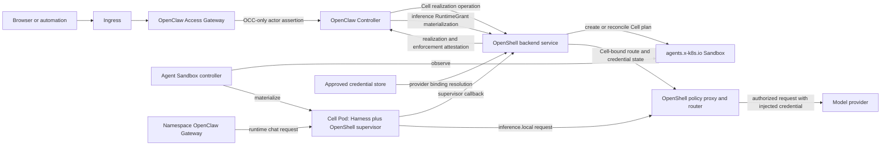

# Proposal: OpenShell Kubernetes Cell and Inference Realization

## Summary

Define one OpenShell Backend that supplies two independently selected OpenClaw
runtime implementations on Kubernetes: `CellRealizationDriver` for physical
Cell lifecycle and a provisionally named `InferenceRuntimeDriver` for
model-provider credential resolution, routing, and request-time enforcement.
The golden deployment selects OpenShell for both capabilities while keeping the
OpenClaw Controller (OCC) as the only product control plane.

OCC owns authorization, tenant resources, desired state, workload identity,
policy, provider and model selection, integration selection, RuntimeGrant, and
canonical audit. OpenShell receives immutable, already-authorized plans over a
private platform interface, creates and supervises the corresponding Kubernetes
Agent Sandbox workload, materializes the exact inference route for the current
Cell, and returns observed state and enforcement attestation. Provider
credentials remain inside the OpenShell credential and proxy boundary and never
enter OCC, an OCC resource, or the agent child process.

## Motivation

[OpenClaw Enterprise PR #35](https://github.com/openclaw/rfcs/pull/35)
names OpenShell in its intended ChatGPT, Gmail, OpenShell, Codex, and Slack
golden application. The referenced `rfcs/components/usecase-impl.md` and
`rfcs/usecase.md` do not exist in that branch, so the proposal does not define
how OpenShell participates.

The enterprise proposal otherwise makes OCC the owner of every primitive and
has OCC directly materialize Cells with native Kubernetes resources. Its
Sandbox Drivers enforce generic containment facets around an OCC-admitted
workload. OpenShell's current architecture assigns sandbox lifecycle to the
OpenShell Gateway and its Kubernetes compute driver, which creates Kubernetes
SIG Agent Sandbox resources and supervises the resulting workload. Applying
both designs without an explicit seam would create two reconcilers that each
believe they own physical sandbox lifecycle.

The enterprise proposal also defers its `InferenceProvider` primitive and does
not define who binds a Cell to a model provider, resolves credentials, rotates
short-lived tokens, or prevents direct provider egress. OpenShell already has a
sandbox-local policy proxy, provider profiles, credential placeholder
resolution, OAuth refresh, dynamic workload-identity token grants, and
`inference.local`. Without an explicit enterprise seam, using that machinery
would either make OpenShell's standalone provider administration a second
product control plane or leave model credentials outside the golden design.

OpenShell's
[platform-managed Kubernetes proposal](https://github.com/NVIDIA/OpenShell/issues/1678)
describes the desired authority split: an enterprise platform owns tenants,
namespaces, policy, approved identity and credentials, placement, audit, and
cleanup intent, while OpenShell acts as the sandbox execution plane. That
proposal is open and is not implemented as a complete contract. This RFC uses
it as requirements input, not as an implementation prerequisite that is
assumed to exist.

## Goals

- Make OpenShell an OpenClaw Backend implementation rather than a competing
  user-facing control plane.
- Define one authoritative writer for logical desired state and one selected
  realizer for physical Kubernetes state.
- Preserve the enterprise proposal's exact authorization,
  `IntegrationSelectionRef`, WorkloadIdentity, RuntimeGrant, and fail-closed
  operation semantics.
- Reuse OpenShell's Kubernetes driver, Agent Sandbox integration, supervisor,
  relay, containment enforcement, provider profiles, credential resolution,
  token refresh, and `inference.local` routing.
- Make OpenShell the golden implementation for model-inference credential and
  routing enforcement without placing provider credentials in OCC, Kubernetes
  workload specifications, or the agent child process.
- Preserve separate selections and conformance contracts for Cell realization
  and inference realization even when one OpenShell Backend supplies both.
- Reuse the workspace isolation and operator-mode Kubernetes mapping proposed by
  OpenShell RFC-0011 for a shared multi-tenant backend.
- Identify the exact subset of OpenShell issue #1678 required by the first
  implementation and distinguish it from deferred optimizations.
- Define conformance criteria shared by the built-in OCC Kubernetes realizer
  and the OpenShell realizer.

## Non-Goals

- Making OpenShell authoritative for OpenClaw users, roles, tenant membership,
  resources, integration selection, or product policy.
- Forwarding OAG sessions, actor assertions, browser credentials, or user OIDC
  tokens to OpenShell.
- Replacing the OCC Console with OpenShell CLI, TUI, or UI surfaces.
- Making Kubernetes interchangeable with a non-Kubernetes enterprise compute
  substrate.
- Redefining OpenShell workspace multi-tenancy. This RFC assumes the required
  parts of OpenShell RFC-0011 are implemented.
- Moving Plugin-service credentials, Channel credentials, OAG credentials, or
  general Secret resolution into the inference capability.
- Defining the general `SecretBroker`, provider installation or interactive
  OAuth consent lifecycle, `SandboxClaim`, `SandboxWarmPool`, or warm-state
  semantics in the first implementation.
- Placing provider credentials or OAuth refresh material in the Cell
  realization plan, OCC resources, Backend metadata, Kubernetes objects, logs,
  or audit evidence.
- Adding a user-facing `OpenShellSandbox` custom resource. The OCC
  `AgentInstance` and `Cell` are the product-facing desired-state resources;
  the Kubernetes SIG Agent Sandbox resource is backend implementation state.
- Defining Namespace update or deletion while the parent enterprise proposal
  defers those operations.

## Proposal

### Relationship to the enterprise proposal

This RFC specializes the draft contracts in OpenClaw Enterprise PR #35 at
commit
[`39a0b336`](https://github.com/openclaw/rfcs/commit/39a0b3360c391bd48a3738ae513747da2ff4b87a).
It does not accept every contract in that umbrella proposal. It supplies the
missing OpenShell golden implementation and proposes two narrow amendments:

> OCC may delegate physical Cell materialization to one server-selected
> `CellRealizationDriver`, while OCC remains the sole owner of the logical Cell,
> admitted realization plan, desired generation, and lifecycle intent.

> OCC may materialize one server-selected, RuntimeGrant-bound inference
> implementation for a Cell. The implementation resolves only the exact
> OCC-selected provider and model, keeps credential values outside OCC, and
> locally enforces the current Cell, WorkloadIdentity, grant, route, endpoint,
> and model binding.

This is not a general compute abstraction. Every v1 implementation targets the
same Kubernetes cluster and exact OCC-created Namespace. Kubernetes remains the
scheduler, infrastructure authorization boundary, and workload substrate.

The built-in OCC Kubernetes implementation is the default
`CellRealizationDriver`. An OpenShell Backend may register an alternate
implementation plus the disjoint Sandbox facets it enforces. Installation
makes that registration eligible; server-owned OCC configuration selects it,
and every operation pins one exact `IntegrationSelectionRef`. Missing or failed
OpenShell state never falls back to the built-in implementation for that
operation or accepted generation.

The same Backend also registers `InferenceRuntimeDriver`; that name is
provisional until the parent enterprise series accepts a provider-neutral
inference contract. The golden deployment selects the OpenShell registrations
for both Cell and inference realization. The registrations retain separate
capabilities, versions, `IntegrationSelectionRef` values, operations, readiness,
and failure domains. Installing or selecting one never implicitly selects the
other, and a failure in either never falls back to another implementation.

### Dependencies and status

This RFC depends on acceptance of the following contracts from PR #35 or their
successor focused RFCs:

- OCC ownership of Namespace, AgentInstance, Cell, and desired lifecycle;
- one OCC Namespace mapped to one immutable Kubernetes Namespace identity;
- OCC-created WorkloadIdentity and dedicated ServiceAccount per AgentInstance;
- server-owned Backend and Driver selection pinned by
  `IntegrationSelectionRef`;
- durable operation identity, result recovery, and fail-closed no-fallback
  behavior;
- OCC-owned `SandboxPolicy`, `Restriction`, RuntimeGrant, and activation
  boundaries; and
- the separation between OAG authentication, OCC authorization, Kubernetes
  authorization, and runtime enforcement.

Inference realization additionally depends on an accepted PR #35 successor
contract that defines:

- the OCC-owned `InferenceProvider` or equivalent provider-neutral resource;
- server-owned provider, model, and inference implementation selection;
- immutable provider and credential-binding references without credential
  values;
- the inference slice of RuntimeGrant materialization, activation, renewal,
  expiry, revocation, and current-Cell binding; and
- provider-neutral readiness, attestation, audit, and no-fallback behavior.

PR #35 currently defers `InferenceProvider`; this RFC defines how OpenShell
realizes that future contract, not the complete provider-neutral contract
itself. The inference portion cannot move from `draft` to `accepted` before the
parent contract exists.

The shared multi-tenant deployment assumes the workspace, provider, policy,
refresh-state, inference-route, audit, and Kubernetes operator-mode scoping in
[OpenShell RFC-0011](https://github.com/NVIDIA/OpenShell/pull/1980) has been
accepted and implemented. RFC-0011 supplies the isolation substrate. It does
not supply OCC authorization, exact RuntimeGrant binding, per-current-Cell
activation, or backend-only provider administration; those remain required by
this RFC.

It does not depend on acceptance of the OCC Console design, the exact fixed IAM
role matrix, Plugin or Channel contracts, general SecretBroker behavior, or
other deferred enterprise primitives. Those surfaces may evolve independently
without changing the realization boundaries defined here.

PR #35 is an umbrella draft and may be replaced by multiple numbered RFCs. If
that happens, this RFC must replace its PR-level dependency with links to the
accepted successor RFCs before it can move from `draft` to `accepted`. This RFC
cannot be accepted or implemented against undefined OCC primitives alone.

### Relationship to the existing OpenShell sandbox plugin

The existing `@openclaw/openshell-sandbox` plugin is a plugin-provided OpenClaw
`SandboxBackend`. It runs from an existing OpenClaw Gateway, derives an
OpenShell sandbox name from an agent or session scope, invokes the user-configured
OpenShell CLI and Gateway, lazily gets or creates the sandbox, obtains SSH
configuration, and routes tool execution and filesystem operations into that
sandbox. Its mirror and remote workspace modes remain useful for single-player,
development, and incremental tool-sandbox deployments.

That contract is distinct from both a capital-B Backend in PR #35 and the
`CellRealizationDriver` and `InferenceRuntimeDriver` defined here. The current
plugin receives OpenClaw session, workspace, and static plugin configuration.
It does not receive or attest the OCC Namespace, AgentInstance, Cell,
WorkloadIdentity, ServiceAccount, desired generation, durable operation,
RuntimeGrant, provider and model selection, credential binding, or exact
`IntegrationSelectionRef` coordinates required by this RFC. Using the plugin
successfully therefore does not establish conformance with either enterprise
realization contract.

An OpenShell enterprise Backend may reuse the plugin's lower-level SSH,
command-execution, filesystem-bridge, and workspace-transfer implementations
when their contracts remain applicable. It must not reuse the plugin's current
lifecycle or authority model as the enterprise control path. In particular,
the enterprise path:

- replaces scope-derived names with exact OCC resource, attempt, generation,
  operation, and immutable Kubernetes coordinates;
- replaces user or static plugin selection of the OpenShell target, source,
  policy, providers, and GPU settings with the admitted OCC plan and
  server-owned integration selection;
- replaces lazy name-based get-or-create and delete with durable idempotent
  operations, exact readback, UID validation, and attestation; and
- authenticates OCC and the current Cell with platform and workload identities
  instead of relying on an end user's OpenShell session.

For a Cell whose `IntegrationSelectionRef` selects the OpenShell
`CellRealizationDriver`, the existing plugin **must not** independently create,
select, replace, or delete another OpenShell sandbox for that Cell. OCC and the
Cell runtime must not configure both lifecycle paths for the same realization.
When the OpenShell `InferenceRuntimeDriver` is selected, the plugin also must
not attach a provider, choose an inference route, copy a host credential, or
configure `inference.local` independently for that Cell.
An OCC-native Cell may continue to use the plugin as a separate tool-sandbox
compatibility mode, but that mode is not an OpenShell-realized Cell under this
RFC and cannot satisfy its conformance criteria.

If an enterprise deployment needs remote execution or filesystem access to an
already-realized Cell, a future attach-only adapter may reuse the plugin's data
path. Such an adapter receives the exact realized sandbox identity from OCC or
the selected Driver and cannot create, replace, delete, select policy for, or
fall back from that realization.

### Authority model

| Concern | Authoritative owner | OpenShell responsibility |
| --- | --- | --- |
| Human and service-principal authentication | OAG | None |
| Exact-resource authorization | OCC IAM | None |
| OCC Namespace and tenant lifecycle | OCC | Maintain an internal partition bound to the immutable Namespace UID |
| Kubernetes Namespace | OCC | Verify exact cluster, name, and UID; never create, adopt, remap, or delete it |
| AgentInstance and logical Cell | OCC | Realize the exact accepted Cell generation |
| Backend selection | OCC configuration | Serve only the exact pinned registration and capability version |
| WorkloadIdentity | OCC | Bind the sandbox and supervisor to the supplied identity |
| Kubernetes ServiceAccount | OCC | Use the exact supplied name and UID; never substitute a shared account |
| Admitted workload | OCC | Materialize it without changing image, command, mounts, identity, or resource bounds |
| Product policy and restriction ceiling | OCC | Enforce supported compiled facets and reject unsupported required facets |
| Physical Agent Sandbox resource | Selected CellRealizationDriver | Create, observe, reconcile, and remove only from the exact OCC plan |
| Agent Sandbox controller descendants | Kubernetes Agent Sandbox controller | Observe and report exact resource UIDs and conditions |
| Inference provider, model, and route intent | OCC | Materialize only the exact selected provider-neutral plan |
| Provider credential provisioning and consent | Deployment-owned external process in v1 | Accept only an opaque, pre-provisioned binding on the backend path |
| Provider credential value and refresh material | OpenShell credential subsystem backed by an approved encrypted or external store | Resolve, rotate, and deliver only to the bound supervisor or proxy; never return through the product API |
| Inference request enforcement | Selected InferenceRuntimeDriver | Bind `inference.local` to the exact current Cell and grant; strip caller auth; enforce provider, endpoint, protocol, and model |
| Runtime/supervisor enforcement | OpenShell | Enforce locally and fail closed when bindings expire or mismatch |
| Canonical product audit | OCC | Emit correlated realization and enforcement evidence |

In backend mode, an OpenShell workspace is not an additional OpenClaw tenant.
It is an enforcement partition keyed by the immutable OCC Namespace UID. A
client, OpenClaw resource, static plugin setting, OpenShell user, or display name
cannot select or change it. Standalone OpenShell mode remains authoritative for
its own workspaces, users, providers, policy, and sandbox lifecycle. One
workspace cannot be both standalone-managed and OCC-managed.

### Deployment architecture

The OpenShell service runs inside the cluster as a private platform component,
normally one highly available deployment per cluster or region. It may reuse
the current OpenShell Gateway process and database internally, but its backend
listener is not a user-facing OpenShell API. No public GRPCRoute, direct CLI
login, workspace administration, or OpenShell user OIDC is required for this
path. Those surfaces remain valid for a separate standalone OpenShell
deployment or standalone-managed workspace, but are not exposed for an
OCC-managed workspace.

For high availability, the OpenShell deployment uses an external durable
database rather than a single-replica local SQLite database. Backend state is
an operational projection keyed by OCC identities; it is not a second
authoritative copy of OCC resources.

Provider credential values and OAuth refresh material use an
installation-approved encrypted credential store or external secret manager
behind the OpenShell credential subsystem. Storing them as ordinary unencrypted
Backend database payloads is not conformant. The OpenShell operational database
may retain opaque binding IDs, versions, expiry, refresh status, and attestation
metadata.

### Resource mapping

| OCC coordinate | OpenShell/Kubernetes coordinate | Rule |
| --- | --- | --- |
| OCC Namespace UID | Internal OpenShell partition ID | Deterministic or durably mapped from UID, never from mutable display name alone |
| Backing Namespace name and UID | Agent Sandbox resource namespace | Exact match required before create and on every observation |
| AgentInstance UID and attempt | OpenShell sandbox identity | Stable idempotency scope for one realization attempt |
| Cell UID and desired generation | Agent Sandbox labels/annotations and backend record | Late or stale generations cannot become current |
| WorkloadIdentity UID | Supervisor/runtime principal binding | Cannot authorize OCC administration or sibling sandboxes |
| ServiceAccount name and UID | Pod service account | Dedicated to one AgentInstance and reused only for its replacement Cells |
| Workload and policy digests | Agent Sandbox metadata and backend record | Returned unchanged in attestation |
| Cell `IntegrationSelectionRef` | OpenShell Cell registration, artifact, and capability version | Fixed before dispatch and rejected on mismatch |
| Inference `IntegrationSelectionRef` | OpenShell inference registration, artifact, and capability version | Selected independently from Cell realization and rejected on mismatch |
| OCC inference-provider UID and model selection | Workspace-scoped OpenShell provider binding and Cell route | Exact mapping; OpenShell cannot substitute its workspace default |
| Opaque credential-binding ref and version | Approved OpenShell credential-store coordinate | Value never enters OCC or Kubernetes resource metadata |
| RuntimeGrant coordinates | Supervisor and inference-route authorization binding | Contains only least-privilege materialization, activation generation, and validity |

Names are lookup inputs, not identity proof. Every security-sensitive mapping
uses immutable UIDs and content digests.

### Cell realization plan

OCC persists the durable operation before dispatch. The request contains at
least:

- stable operation ID, deadline, action, and desired generation;
- exact Cell `IntegrationSelectionRef`;
- OCC Namespace UID, backing cluster ID, Namespace name, and Namespace UID;
- AgentInstance UID, Cell UID, rollout or replacement attempt, and activation
  generation;
- WorkloadIdentity UID;
- dedicated ServiceAccount name and expected UID;
- admitted workload specification or immutable reference and digest;
- compiled Sandbox facet input, `SandboxPolicy` digest, applicable restriction
  ceiling digest, and required attestation set;
- RuntimeGrant binding coordinates and validity when needed by the supervisor;
- implementation-owned resource allowlist;
- source operation, audit correlation, and trace identifiers.

The request is a realization command, not an authorization request. OpenShell
cannot fill missing coordinates from workspace membership, user roles,
defaults, request names, or previously stored standalone configuration.

OpenShell validates the complete plan before the first side effect. It may add
implementation metadata, the supervisor delivery mechanism, callback
configuration, and security controls required to enforce the plan. Those
additions must be declared by the selected capability and cannot broaden the
admitted workload, policy, identity, placement, or resource ceiling.

### Inference realization plan

Inference state is a separate RuntimeGrant materialization, not a field added
to the generic Cell realization request. OCC stages it inactive through the
selected `InferenceRuntimeDriver`. The request contains at least:

- exact inference `IntegrationSelectionRef`, operation identity, input digest,
  deadline, and source-operation correlation;
- OCC Namespace, AgentInstance, WorkloadIdentity, candidate or current Cell,
  RuntimeGrant, activation generation, and validity coordinates;
- exact OCC inference-provider identity, selected model or allowed model set,
  and provider-neutral route requirements;
- opaque credential-binding identity, version, and expected credential class,
  but no credential value or refresh material;
- allowed upstream authority, protocol and request patterns, required header
  handling, timeout ceiling, and direct-egress prohibition;
- compiled applicable Sandbox network facets and Restriction digests; and
- required readiness and enforcement attestations.

OpenShell resolves the opaque provider binding only inside the OCC-derived
workspace partition. It cannot select a workspace default, attach another
provider profile, widen the model set, change the endpoint, or use a credential
from another workspace. A provider binding must already exist through the
deployment-owned provisioning path; an inference realization request cannot
create, consent, import, or discover credentials.

OpenShell stages the route for the candidate Cell but keeps it unusable until
the parent activation generation is current. The active local slot is keyed by
AgentInstance and inference capability. Activation atomically replaces the
prior route; a late candidate, prior Cell, expired grant, or stale credential
version cannot resolve or use credentials.

### Physical realization

For the OpenShell implementation:

1. OCC creates and records the backing Namespace, WorkloadIdentity, and
   dedicated ServiceAccount before dispatch.
2. OpenShell verifies the Namespace and ServiceAccount UIDs and validates every
   required policy facet.
3. OpenShell creates or reconciles one `agents.x-k8s.io/Sandbox` resource in
   that exact Namespace. Its metadata binds the OCC operation, Namespace,
   AgentInstance, Cell, attempt, generation, workload, policy, identity, and
   selection coordinates.
4. The Agent Sandbox controller materializes the workload and controller-owned
   descendants.
5. OpenShell observes the exact Sandbox and Pod UIDs, verifies the dedicated
   ServiceAccount and admitted plan, and establishes the supervisor binding.
6. OpenShell returns readiness and enforcement attestation to OCC.
7. OCC accepts readiness only when every coordinate and digest matches current
   committed state. OCC then performs the parent proposal's RuntimeGrant and
   Cell activation boundary.

OCC does not create another Pod or Agent Sandbox resource for a Cell delegated
to OpenShell. OpenShell does not create the Namespace, WorkloadIdentity,
ServiceAccount, Kubernetes RBAC, OCC Cell, or RuntimeGrant.

The implementation-owned resource allowlist initially permits the Agent
Sandbox resource and controller-owned descendants admitted by the selected
capability. OpenShell cannot create arbitrary Roles, RoleBindings,
ClusterRoles, ClusterRoleBindings, Namespaces, or static ServiceAccount token
Secrets.

### Inference credential and request flow

For the OpenShell inference implementation:

1. A deployment-owned process provisions or updates the provider credential in
   the approved OpenShell credential store and exposes only an opaque,
   workspace-scoped binding to OCC administration.
2. OCC authorizes and commits the provider and model selection, then stages the
   exact inference RuntimeGrant materialization through the pinned OpenShell
   registration.
3. OpenShell validates the OCC workspace, WorkloadIdentity, candidate Cell,
   grant, provider, model, route, policy, and credential-binding version. It
   prepares a Cell-scoped `inference.local` route and attests readiness without
   returning credential material.
4. OCC activates the RuntimeGrant and current Cell only after Cell and inference
   readiness agree on the same activation generation.
5. The Harness sends model requests to `https://inference.local` with no real
   provider credential. OpenShell terminates the local TLS connection, accepts
   only a supported request shape, strips caller-supplied authorization and
   disallowed headers, enforces the selected model and upstream route, and
   injects the resolved credential immediately before the upstream request.
6. The real credential may exist only in the OpenShell credential subsystem and
   trusted supervisor or router memory for the exact active binding. It never
   enters the agent child environment, OCC, a Kubernetes object, a Cell plan,
   logs, or audit evidence.
7. Rotation updates the exact credential version and route without recreating
   the Cell when the provider contract permits hot refresh. Revocation,
   expiration, missing refresh state, route mismatch, or OpenShell outage fails
   new inference requests closed without direct-provider or alternate-provider
   fallback.

The effective Sandbox policy denies direct egress from the agent child to the
selected model-provider authority. `inference.local` is the only admitted model
path. TLS termination and credential injection occur only inside the trusted
OpenShell supervisor and proxy boundary; opaque passthrough routes cannot carry
credential placeholders.

### Result and attestation

The durable result follows the parent integration states: `succeeded`,
`failed`, `pending`, or `indeterminate`. It reports:

- operation ID, selected registration, target generation, and input digest;
- stable OpenShell partition and sandbox identifiers;
- observed cluster, Namespace, Agent Sandbox, Pod, and ServiceAccount UIDs;
- admitted workload digest and enforced policy digest;
- supported and enforced Sandbox facets;
- supervisor identity and current-Cell binding evidence without credentials;
- inference registration, RuntimeGrant and activation generation, provider and
  model selection digests, route revision, credential-binding version and
  expiry, and direct-egress enforcement evidence without credential values;
- readiness and lifecycle conditions;
- stable failure reason and retry classification;
- source operation and audit correlation identifiers.

`succeeded` means the exact requested state is observed and attested. It does
not authorize OCC activation by itself. OCC independently verifies current
state and every other required runtime materialization.

### Authentication and runtime identity

OAG assertions are audience- and purpose-bound to OCC. OCC never forwards an
OAG assertion, browser cookie, user OIDC token, API key, or service-principal
credential to OpenShell.

OCC calls the backend using an installation-issued platform service identity
over mutually authenticated transport or an equivalent workload-identity
mechanism. OpenShell authenticates the exact allowed OCC dispatcher and verifies
request integrity. NetworkPolicy restricts the backend listener to OCC and
required supervisor callbacks.

The sandbox supervisor may retain OpenShell's projected ServiceAccount token
bootstrap and short-lived sandbox JWT mechanism. In backend mode the resulting
principal is bound to:

- OCC Namespace UID;
- AgentInstance, Cell, and realization attempt;
- WorkloadIdentity and observed ServiceAccount UID;
- current RuntimeGrant or explicit supervisor method set;
- exact OpenShell Cell and inference registration identities; and
- short expiry and revocation state.

It grants no OpenShell Platform Admin, Workspace Admin, User, or workspace-wide
authority. A prior, sibling, or unrecorded Cell cannot use the binding.

### Policy

OCC owns product policy. It compiles each selected OpenShell Sandbox facet from
the effective `SandboxPolicy`, applicable `Restriction` ceiling, backend
capabilities, admitted workload, and identity.

OpenShell may:

- enforce the supplied facets;
- apply a declared installation maximum that only tightens the supplied plan;
- reject unsupported, contradictory, or unattestable requirements; and
- report the exact effective enforcement digest.

OpenShell may not:

- attach a user- or workspace-selected provider profile;
- use a gateway- or workspace-default inference provider or model in place of
  the OCC selection;
- union additional permissions into the plan;
- silently omit or weaken an unsupported restriction;
- treat workspace membership or OpenShell role as policy authority; or
- turn a maximum policy into active permission.

OpenShell's managed-maximum-policy work may implement the local tightening
ceiling, but it is not assumed complete by this RFC. The same effective-policy
candidate must be checked on every authority-changing path.

### Operation, retry, and deletion semantics

- The operation ID is idempotent for the exact target, action, selection,
  generation, and input digest. Mismatched reuse is rejected.
- A retry cannot create a second physical sandbox for the same Cell attempt.
- An older or superseded generation cannot overwrite, reactivate, or become
  current after a newer generation.
- OpenShell durably retains operation outcomes through the required
  acknowledgement window and exposes `getOperation` or authoritative readback.
- OCC resolves `pending` or `indeterminate` results before creating a successor
  operation. It never blindly retries a possibly completed side effect.
- OpenShell unavailability does not cause OCC to select another implementation.
- An inference materialization retry cannot create a second active route or
  attach another provider for the same AgentInstance and activation generation.
- Credential rotation is compare-and-swap bound to the exact credential-binding
  version. A stale refresh or route result cannot overwrite a newer binding.
- Expiry, revocation, current-Cell loss, or inference-route mismatch denies
  locally even when OCC is unavailable.
- A committed tightening invokes the parent proposal's stopped baseline until
  exact enforcement is ready. Unresolved non-tightening work may preserve the
  current deployment.
- Stop, supersession, and deletion reconcile the exact physical realization to
  absent. Cleanup retries forward and cannot restore authority.
- OpenShell cannot delete an OCC Namespace, ServiceAccount, logical resource,
  or another realization as a side effect.

Because the parent proposal defers Namespace deletion, this RFC does not define
OpenShell partition deletion. Orphan detection may report stale implementation
state but cannot independently destroy a Namespace or remap it to another OCC
identity.

### Audit

OCC remains the canonical audit owner because it knows the initiating actor,
exact authorization decision, committed desired state, and integration
selection. OpenShell emits correlated subordinate evidence for realization and
enforcement.

Records distinguish:

- initiating Principal or ServicePrincipal;
- acting OCC and OpenShell platform component identities;
- runtime WorkloadIdentity and supervisor principal;
- Namespace, AgentInstance, Cell, attempt, operation, selection, and audit
  correlation IDs;
- admitted workload and policy digests; and
- inference provider and model selection digests, route revision,
  credential-binding version and expiry, and refresh outcome reason codes; and
- observed Kubernetes UIDs and enforcement result.

OpenShell OCSF output may be exported as infrastructure evidence, but it cannot
be the only record of the OCC authorization transaction. Credentials, actor
assertions, secret values, provider payloads, and message content are never
included.

### Relationship to OpenShell multi-player RFC-0011

[OpenShell RFC-0011](https://github.com/NVIDIA/OpenShell/pull/1980) supplies the
multi-tenant substrate assumed by this RFC. It makes workspaces hard isolation
boundaries; scopes sandboxes, providers, provider refresh state, provider
profiles, inference routes, policy, audit, and storage by workspace; binds a
supervisor credential path to one sandbox; and adds Kubernetes operator mode
for one-to-one mapping to pre-existing Namespaces.

RFC-0011 also defines a standalone product mode in which the OpenShell Gateway
owns workspaces, user roles, membership, quotas, provider administration,
policy, sandbox lifecycle, and direct OIDC authentication. OpenShell is the
control plane in that mode. This RFC does not weaken or replace that authority.

An OCC-managed workspace uses the same isolation machinery with a different
authority mode:

- the OpenShell service is private and authenticates OCC, not end users;
- the workspace is durably marked OCC-managed and bound to the immutable OCC
  Namespace UID and exact pre-existing Kubernetes Namespace identity;
- OCC IAM replaces OpenShell user and workspace authorization for product
  actions;
- direct OpenShell CLI, SDK, TUI, OIDC, membership, provider attachment,
  provider mutation, policy mutation, and sandbox lifecycle calls are rejected
  for that workspace;
- OCC supplies the exact Namespace, Cell, policy, inference provider, model,
  credential binding, and RuntimeGrant plans;
- OpenShell quota, credential-store, and maximum-policy rules may only tighten
  OCC admission; and
- OpenShell runtime state remains subordinate to OCC desired state.

RFC-0011 workspace scoping is necessary but not sufficient. Its workspace is a
shared credential trust boundary and its inference routes are workspace-scoped.
This RFC additionally requires an inference route bound to one AgentInstance,
exact current Cell, WorkloadIdentity, RuntimeGrant and activation generation.
No standalone workspace role may create or change that binding.

A workspace has exactly one authority mode for its lifetime. Converting an
existing standalone workspace to OCC-managed, or the reverse, is a separately
authorized migration outside this RFC. A single OpenShell deployment may host
different workspaces in different modes if every API, storage, watch, cache,
provider, policy, inference and audit path enforces the mode boundary.

The static `plugins.entries.openshell.config.workspace` example in RFC-0011 is
a standalone compatibility mechanism. It is not the OCC integration contract.

### Relationship to OpenShell issue #1678

This RFC does **not** assume issue #1678 has been implemented. It divides that
proposal into required first-version capabilities and deferred features:

| #1678 capability | This RFC | Required OpenShell change |
| --- | --- | --- |
| Trusted target Namespace | Required | Accept it only on the authenticated backend path; verify Namespace UID; remove the single global namespace assumption for this path |
| Per-sandbox ServiceAccount | Required extension | Accept the OCC-selected account per realization and verify UID instead of using one chart-wide sandbox account |
| Final compiled policy | Required | Accept, enforce, and attest the OCC-compiled Sandbox facet plan |
| Metadata propagation | Required | Carry immutable OCC coordinates and digests to backend and Kubernetes state |
| Lifecycle events and observations | Required | Return normalized durable operation state and exact infrastructure UIDs |
| Runtime placement | Minimal required subset | Accept only OCC-admitted image, RuntimeClass, resources, and selected placement fields supported by the capability |
| Kubernetes Secret references | Not used for model credentials | Resolve model credentials through the selected OpenShell inference capability and approved credential store; keep general SecretBroker support separate |
| `SandboxClaim` | Deferred | May become another physical realization strategy after direct `Sandbox` conformance |
| `SandboxWarmPool` | Deferred | Must preserve tenant, identity, clean-state, policy, and attestation invariants before adoption |
| Warm customer state | Prohibited | Never reuse credentials, writable workspace state, supervisor sessions, or prior tenant identity |

OpenShell RFC-0011 operator mode supplies per-workspace target Namespaces but
does not itself supply per-AgentInstance ServiceAccounts, OCC operation
recovery, exact current-Cell inference bindings, backend-only provider
administration, or OCC attestation. Those remain OpenShell implementation work.
Acceptance of this RFC authorizes neither repository's implementation by
itself; accepted implementation issues and code review remain required.

### Conformance criteria

The built-in OCC Kubernetes realizer and OpenShell Cell realizer must pass the
same provider-neutral lifecycle suite. Every inference implementation must pass
the future parent contract's provider-neutral inference suite. The OpenShell
implementation additionally proves its supervisor, Agent Sandbox, workspace,
credential, and `inference.local` mappings.

Required cases include:

1. Create one Cell in the exact OCC Namespace with the dedicated
   ServiceAccount and activate only after attestation.
2. Reject Namespace name/UID mismatch and never adopt the same name with a
   different UID.
3. Reject a missing, shared, substituted, or mismatched ServiceAccount.
4. Reject workload, policy, selection, attempt, or generation substitution.
5. Reject unsupported required Sandbox facets before activation.
6. Prove OpenShell can tighten but cannot broaden the OCC plan.
7. Return the same result for an exact operation retry without creating a
   duplicate sandbox.
8. Keep a late result from a superseded generation ineligible for activation
   and reconcile it to absent.
9. Replace a like-for-like Cell without changing WorkloadIdentity or granting
   the prior Cell current authority.
10. Fail runtime actions locally after RuntimeGrant expiry or binding mismatch
    while OCC is unavailable.
11. Recover an in-flight operation after OCC, OpenShell, or Agent Sandbox
    controller restart.
12. Reconcile stop and deletion forward without restoring authority after
    partial cleanup failure.
13. Prove an OAG assertion, OpenShell user, workspace role, and direct client
    request cannot invoke the backend path.
14. Correlate OCC canonical audit with OpenShell realization and enforcement
    evidence without recording credentials.
15. Isolate two OCC Namespaces with same-named OpenShell provider bindings and
    prove neither can observe, attach, resolve, refresh, route, or audit against
    the other's provider or credential state.
16. Reject an inference materialization for the wrong Namespace,
    AgentInstance, WorkloadIdentity, Cell, RuntimeGrant, activation generation,
    provider, model, route, credential-binding version, or inference selection.
17. Keep a staged inference route unusable before activation and atomically
    replace the prior current-Cell route at activation.
18. Strip caller-supplied authorization, enforce the selected provider,
    endpoint, protocol and model, and inject only the exact bound credential on
    a supported `inference.local` request.
19. Deny direct model-provider egress and deny unsupported opaque TLS or request
    shapes that would bypass credential or model enforcement.
20. Apply credential rotation to the exact active binding without Cell
    recreation when hot refresh is supported, and reject a stale refresh result.
21. Deny locally after credential, RuntimeGrant, route, or current-Cell expiry or
    revocation while OCC is unavailable and never select another provider.
22. Prove no real provider credential or refresh material enters the agent child
    environment, OCC, Backend metadata, Kubernetes objects, Cell plans, logs, or
    audit evidence.
23. Prove direct OpenShell CLI, SDK, TUI, OIDC, workspace-role, provider, policy,
    and sandbox lifecycle paths cannot mutate an OCC-managed workspace, while a
    separate standalone-managed workspace retains normal OpenShell authority.

## Rationale

### Delegate physical realization, not product authority

OpenShell's useful implementation includes Kubernetes resource creation,
supervisor injection and callback, lifecycle observation, relay, and
containment. Requiring OCC to create the final workload and asking OpenShell to
adopt it would preserve the umbrella RFC literally but bypass much of the
existing implementation and may make pre-execution enforcement racy.

An immutable OCC plan plus a narrow selected realizer preserves OpenShell's
implementation value without transferring tenant, authorization, policy, or
desired-state ownership. It also gives the built-in Kubernetes path and
OpenShell one explicit conformance target.

### Keep inference realization separate from Cell realization

One OpenShell Backend supplies both implementations in the golden deployment,
but credential and inference state is not part of the Kubernetes workload plan.
Separate registrations let OCC select, version, stage, activate, revoke,
attest, and replace the two capabilities without exposing credential values or
turning Cell creation into provider administration. This also permits a future
deployment to select OpenShell for only one capability without hidden fallback
or coupled authority.

### Keep the seam Kubernetes-specific in v1

The enterprise proposal chooses Kubernetes for Namespace isolation, admission,
scheduling, workload identity, and reconciliation. This RFC does not introduce
a generic VM, Docker, or arbitrary compute contract. The realizer can choose
which admitted Kubernetes resource represents a Cell, but it cannot replace
the substrate or scheduler.

### Keep OpenShell authority mode explicit

Direct OpenShell deployments still need their own users, workspaces, roles, and
OIDC, and OpenShell is authoritative for them. Reusing those authorities inside
an OCC-managed workspace would duplicate tenant and IAM decisions. An immutable
per-workspace authority mode lets the same OpenShell deployment serve both
products without making either control plane authoritative for the other's
resources.

### Alternatives considered

**OCC creates the Pod or Agent Sandbox resource and OpenShell adopts it.** This
fits PR #35's current wording and could be viable if OpenShell can install every
required enforcement boundary before execution. It is not selected because the
current Kubernetes driver and supervisor lifecycle are designed around
OpenShell-created sandbox state, and adoption would require a separate proof of
equivalent pre-execution enforcement.

**OCC users authenticate directly to OpenShell.** This reuses RFC-0011 roles but
creates two tenant and authorization control planes, forwards unnecessary user
identity, and makes audit composition ambiguous. It is rejected.

**Configure one static OpenShell workspace per OpenClaw plugin.** This preserves
today's CLI integration but cannot bind exact OCC resources, generations,
identities, policy, selection, or durable operations. It is retained only as a
standalone compatibility path.

**Use one workspace-global `inference.local` route.** RFC-0011 scopes inference
routes to a workspace, which prevents cross-workspace credential use but still
lets every sandbox in the workspace share one route. OCC requires exact
AgentInstance, current-Cell, WorkloadIdentity, RuntimeGrant and activation
binding, so this is insufficient for the enterprise path.

**Inject a Kubernetes Secret into the Cell.** This would expose a reusable
credential to the workload environment, couple rotation to Kubernetes objects,
and permit SDK traffic to bypass OpenShell's provider, endpoint and model
enforcement. It is rejected for model credentials; the selected OpenShell
inference path resolves and injects them at the proxy boundary.

**Deploy one OpenShell Gateway per OCC Namespace.** This can be a temporary
proof or compliance shard and works around current single-namespace
configuration. It is rejected as the target because it is operationally heavy
and duplicates control-plane state for every tenant.

**Add an OpenShell-owned user-facing CRD.** OCC AgentInstance and Cell already
provide the higher-level desired state. Another product-facing CRD would create
a second canonical resource and reconciliation bridge. It is rejected for this
integration; the existing Agent Sandbox CR remains private implementation
state.

## Security considerations

- Every OAG or end-user credential terminates before OCC and never crosses the
  OpenShell backend boundary. Model-provider credentials originate or resolve
  inside the OpenShell credential boundary and never cross into OCC.
- OCC and OpenShell platform component identities are distinct from workload
  ServiceAccounts and runtime principals.
- The OpenShell controller identity receives only the Kubernetes permissions
  required to reconcile admitted Agent Sandbox resources and observe their
  descendants in OCC-created Namespaces.
- A single shared backend increases blast radius. Exact per-operation
  coordinates, namespace-scoped RBAC where practical, admission controls,
  NetworkPolicy, immutable UID checks, and audit correlation are mandatory.
- The combined OpenShell supervisor topology may require elevated Linux
  capabilities. The Backend capability declaration must expose those
  requirements, and OCC policy must reject deployment when the installation
  restriction ceiling does not permit them. A RuntimeClass may add isolation
  but does not replace supervisor enforcement.
- Backend operational state is untrusted for product authorization. OCC always
  derives authority from committed canonical state and accepts observations
  only when all coordinates match.
- The approved OpenShell credential store must encrypt credential values and
  refresh material at rest or keep them in an external secret manager. Database
  file permissions alone are insufficient for the enterprise Backend.
- The trusted supervisor and proxy may hold an exact active credential in
  memory only as required to inject or sign an authorized request. The agent
  child receives no real model credential, and crash output, tracing, OCSF,
  metrics, readiness, attestation, and diagnostics must redact values.
- Network policy and OpenShell policy must deny direct agent-child egress to
  model-provider authorities. TLS termination, request validation, credential
  injection, and model enforcement must occur on the admitted
  `inference.local` path before upstream transmission.
- Workspace scoping alone is not runtime authorization. Credential resolution
  also verifies exact WorkloadIdentity, current Cell, RuntimeGrant, activation
  generation, provider, route, model, credential-binding version, and validity.
- Standalone and OCC-managed authority paths must be disjoint for each
  workspace. A cache key, watch, list, provider lookup, refresh worker,
  inference bundle, or audit stream that omits workspace identity is a
  cross-tenant security defect.
- No fallback is allowed after selection because switching realizer or policy
  enforcement after authorization could widen authority or duplicate effects.

## Implementation sequence

1. Accept or revise the provider-neutral `CellRealizationDriver` ownership
   boundary and define the provider-neutral inference resource, selection, and
   RuntimeGrant contract in the OpenClaw enterprise RFC series.
2. Implement the required RFC-0011 workspace scoping and Kubernetes operator
   mode in OpenShell, including workspace-scoped providers, refresh state,
   inference routes, policy, caches, watches, storage, and audit.
3. Define versioned request, result, capability, operation-recovery, activation,
   and attestation schemas plus backend-neutral Cell and inference conformance
   tests.
4. Put the OCC-native Kubernetes implementation behind the Cell seam and prove
   no behavior or authority regression.
5. Add immutable standalone-managed and OCC-managed OpenShell workspace modes,
   private OCC authentication, per-plan Namespace and ServiceAccount inputs,
   durable operation recovery, exact metadata, and attestation.
6. Add the approved credential-store integration and backend-only provisioning
   path for opaque workspace-scoped provider bindings.
7. Add AgentInstance- and current-Cell-bound `inference.local` routes with exact
   inference RuntimeGrant materialization, activation, rotation, expiry,
   revocation, direct-egress denial, and attestation.
8. Run a two-Namespace vertical slice with different provider credentials and
   models, direct Agent Sandbox creation, the OpenShell supervisor, and a model
   request through `inference.local`.
9. Add replacement, tightening, rotation, expiry, revocation, stop, deletion,
   restart, stale-result, cross-tenant, and direct-management negative cases.
10. Consider deferred #1678 capabilities only after both direct realization
    paths pass conformance.

## Unresolved questions

1. Should the capability be named `CellRealizationDriver`,
   `CellRuntimeDriver`, or another term that cannot be confused with Backend
   packaging or a general compute abstraction?
2. Should OCC create the Agent Sandbox resource from an OpenShell-produced
   immutable plan instead of delegating creation, and can that alternative
   prove equivalent pre-execution enforcement?
3. Which Agent Sandbox API version and resource fields form the first pinned
   implementation contract?
4. Which exact Kubernetes resources may the OpenShell implementation create
   directly, and which must be controller-owned descendants?
5. How is namespace-scoped backend RBAC installed and removed when OCC
   Namespace deletion is not yet defined?
6. Which Sandbox facets and supervisor capabilities are mandatory for the
   first OpenShell conformance level?
7. Does the installation-wide projected ServiceAccount audience set already
   include the required OpenShell supervisor bootstrap audience?
8. What durable store and acknowledgement window satisfy operation recovery
   for a highly available OpenShell backend?
9. How should one OpenShell backend deployment be sharded by region, cluster,
   risk class, or capacity without making the shard client-selectable?
10. Which parts of OpenShell RFC-0011 should define common internal machinery
    shared by standalone and backend modes, and which remain standalone-only?
11. What provider-neutral name and contract should replace the provisional
    `InferenceRuntimeDriver`?
12. Which OCC resource owns the provider and model selection, opaque credential
    binding, route constraints, and rotation policy once `InferenceProvider` is
    defined?
13. Which provisioning component creates the opaque OpenShell provider binding,
    and how does it complete interactive OAuth consent without making the
    OpenShell UI authoritative for an OCC-managed workspace?
14. Which encrypted or external credential-store implementations satisfy the
    first enterprise conformance level, and may the trusted supervisor receive
    an active value or must injection occur in an out-of-Pod proxy?
15. Does the first inference contract allow one selected model, an immutable
    allowlist, or a provider-owned router policy, and how is that choice attested?
16. Can standalone-managed and OCC-managed workspaces safely share one OpenShell
    Gateway process, or should the first implementation enforce deployment-level
    authority mode while preserving the per-workspace contract for the future?
