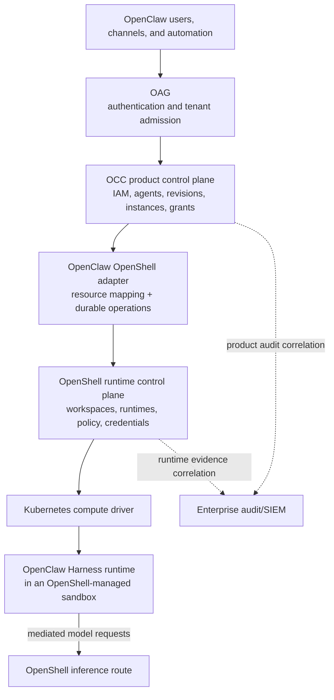
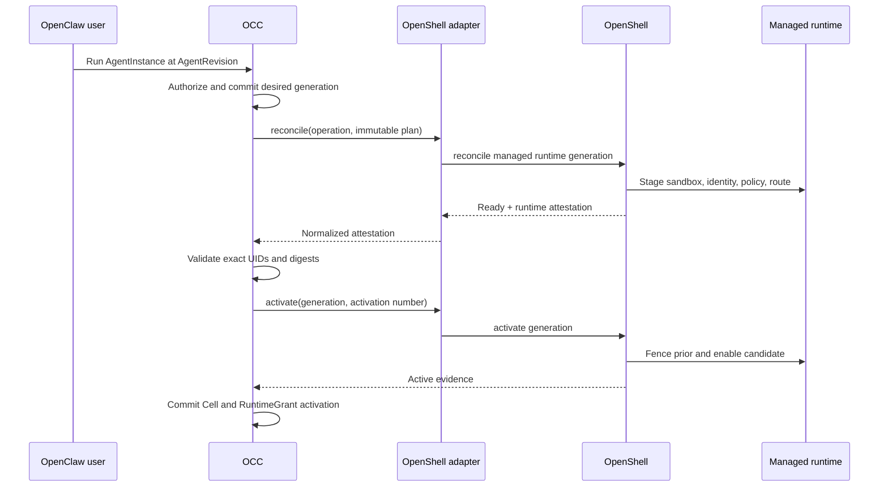
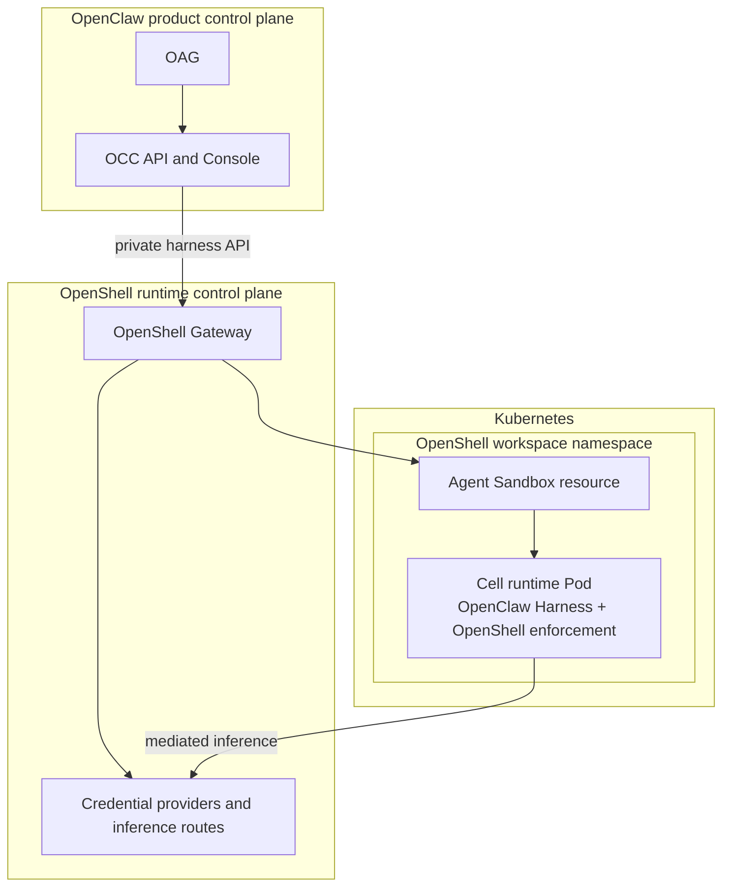

# Proposal: OCC Integration with the OpenShell Runtime Control Plane

## Summary

Define OpenShell as the golden and reference implementation of a
harness-agnostic runtime control plane consumed by the OpenClaw Controller
(OCC). OCC remains OpenClaw's product control plane and owns product identity,
authorization, agent resources, desired lifecycle, integrations, RuntimeGrants,
user experience, and canonical product audit. OpenShell owns managed runtime
workspaces, physical sandbox lifecycle, runtime identity realization, runtime
policy enforcement, provider credentials, inference routing, and runtime
attestation. An OpenClaw-owned adapter maps OCC resources and operations onto
the versioned OpenShell harness API without making either system an
implementation detail of the other. OCC's runtime-control-plane capability
remains provider-neutral so another implementation can satisfy it.

## Motivation

[OpenClaw Enterprise PR #35](https://github.com/openclaw/rfcs/pull/35)
proposes OCC, the OpenClaw Access Gateway (OAG), enterprise IAM, platform
primitives, integration contracts, and the OCC Console. It also assumes that
OCC creates Kubernetes Namespaces, ServiceAccounts, Pods, and Cell workloads
directly, while Sandbox Drivers enforce selected facets around those
OCC-created resources. OpenShell is named in the intended golden application,
but its role is not defined.

That ownership model overlaps with OpenShell. OpenShell already treats the
Gateway as the owner of sandbox lifecycle and uses compute drivers to realize
the workload. It also owns policy enforcement, provider credential resolution
and refresh, and mediated inference through `inference.local`. If OCC and
OpenShell both reconcile the same Pod or Agent Sandbox resource, neither system
can provide authoritative readiness, deletion, recovery, or audit evidence.

The initial
`OpenShell Kubernetes Cell and Inference Realization` draft explores a narrower
answer: keep OCC as the only control plane and use OpenShell as two OCC runtime
Drivers. That is a valid alternative when OpenShell is intentionally reduced to
an OpenClaw backend. It does not create a reusable contract for other harnesses
and leaves OpenShell's own workspace, credential, policy, and runtime lifecycle
APIs subordinate to each product integration.

This RFC instead adopts a layered control-plane model:

> OpenShell is the harness-agnostic runtime control plane. OCC is OpenClaw's
> product control plane. OCC consumes OpenShell's runtime APIs and layers
> OpenClaw-specific identity, agent lifecycle, integrations, and user
> experience on top.

This lets both projects address enterprise requirements at their natural
authority boundaries. OpenClaw does not need to duplicate a secure runtime
platform, and OpenShell does not need to become an OpenClaw-specific product
control plane.

## Goals

- Give OCC and OpenShell one authoritative writer for every logical and
  physical resource.
- Map the enterprise primitives proposed in PR #35 onto a reusable OpenShell
  runtime contract without putting OpenClaw concepts in OpenShell core.
- Use OpenShell for both managed Cell execution and model-provider credential
  and inference enforcement.
- Preserve OCC's authorization, immutable publication, RuntimeGrant,
  integration selection, activation, failure, and audit invariants.
- Preserve OpenShell's ownership of sandbox lifecycle, compute drivers,
  policy enforcement, credential use, and runtime observations.
- Support Kubernetes deployments without OCC and OpenShell independently
  creating or adopting the same Namespace, ServiceAccount, Pod, or Agent
  Sandbox resource.
- Define how the existing OpenShell sandbox plugin coexists with the enterprise
  integration and can evolve without becoming the control-plane protocol.
- Keep the OCC runtime contract implementable by runtime control planes other
  than OpenShell.

## Non-Goals

- Replacing OCC, OAG, the OCC Console, or OpenClaw IAM with OpenShell.
- Making OpenShell aware of OpenClaw `Agent`, `AgentRevision`, `Cell`,
  `RuntimeGrant`, Plugin, Channel, conversation, or Console semantics.
- Moving OpenClaw channel or Plugin provider credentials into OpenShell by
  default. This RFC moves model-inference credentials and explicitly selected
  runtime credentials only.
- Defining the complete OpenShell external-harness API. That contract belongs
  in the OpenShell RFC and is consumed here.
- Declaring the first OpenShell wire protocol an industry standard before it
  has independent implementations and governance.
- Requiring every OpenClaw installation to use OpenShell. Local and existing
  sandbox backends remain valid product choices.
- Treating each chat session as a new runtime or Kubernetes Pod.
- Merging or superseding the initial #35-dependent OpenShell RFC before the
  projects choose between the narrow Driver model and this layered model.

## Proposal

### Architecture decision

OCC and OpenShell are hierarchical control planes with disjoint authority.

OCC is a client of OpenShell. It is not an OpenShell implementation. The
OpenClaw Harness is the workload that runs inside an OpenShell-managed runtime;
it is not the runtime control plane.

The OpenShell integration is packaged as an OpenClaw Backend because PR #35
uses Backend as the distribution and compatibility unit for Drivers and
Adapters. The package does not make OpenShell subordinate to OCC. It contains
the OpenClaw-side adapter that implements an OCC runtime capability by calling
the public OpenShell harness API.

### Contract layering and portability

The design has two contracts rather than one OpenShell-specific seam:

1. OCC defines a provider-neutral `RuntimeControlPlaneDriver` contract. It
   standardizes the semantics OCC needs: immutable generations, durable
   operations, activation, fencing, runtime leases, attestation, and
   fail-closed recovery. It does not expose OpenShell resource types.
2. OpenShell defines a public external-harness API and conformance suite that
   satisfy those semantics. The OpenClaw OpenShell adapter maps between the two
   contracts.

OpenShell is the golden and reference implementation, not the only permitted
implementation. Another runtime control plane has two options:

- implement the OpenShell external-harness protocol and reuse the OpenClaw
  OpenShell-compatible adapter; or
- ship another OpenClaw Backend whose Driver maps the provider-neutral OCC
  contract to its own API.

The first option encourages an interoperable protocol without coupling OCC to
OpenShell internals. The second preserves product portability if that protocol
does not fit another implementation. After the contracts have been proven by
multiple independent harnesses and runtime control planes, the common wire
protocol may be extracted into a neutrally governed specification. This RFC
does not require that standards process for v1.

### Dependencies

This RFC depends on three design inputs:

1. **OpenClaw Enterprise PR #35 or successor RFCs.** OCC, OAG, IAM, `Namespace`,
   `AgentRevision`, `AgentInstance`, `Cell`, WorkloadIdentity, SandboxPolicy,
   Restriction, RuntimeGrant, integration selection, and durable operation
   semantics must exist in an accepted form.
2. **OpenShell RFC-0011 or its successor.** The OpenShell deployment needs
   workspaces, workload identity, quotas, audit attribution, workspace-scoped
   policy and providers, and Kubernetes namespace mapping. PR #1980 proposes
   this substrate.
3. **The OpenShell External Harness Runtime Control Plane RFC.** OpenShell must
   expose stable workspace binding, immutable runtime generation, durable
   operation, activation, credential binding, inference route, and attestation
   contracts.

This RFC does not assume
[OpenShell issue #1678](https://github.com/NVIDIA/OpenShell/issues/1678) is
implemented. That issue gives an external Kubernetes platform authority over
runtime namespaces, final policy, Secret references, and placement. Under this
RFC, OpenShell owns those runtime objects and OCC supplies product intent. The
two modes may reuse implementation primitives but have different writers.

### Current OpenShell layer coverage

OpenShell already implements much of the enforcement foundation, but it does
not yet satisfy every layer required by the golden OCC integration. The
integration depends on current behavior, accepted OpenShell RFCs, and new work
defined by the external-harness contract. This table distinguishes those
states so the proposal does not describe planned behavior as available today.

| Harness-agnostic layer | Current OpenShell capability | Coverage | Required for the golden OCC integration |
| --- | --- | --- | --- |
| Workload lifecycle and placement | The Gateway owns sandbox lifecycle and delegates physical realization to Kubernetes, Docker, Podman, and VM compute drivers. Resource requirements can map to driver-native CPU, memory, and GPU controls. | Substantial | Add immutable runtime generations, durable operation lookup, staging, activation, fencing, and generation-specific readiness. |
| Sandboxing and isolation | The supervisor enforces process identity, filesystem boundaries, network mediation, and sandbox-local runtime controls. | Substantial | Prove workspace and runtime isolation under shared multi-tenant use and bind enforcement evidence to the exact active generation. |
| Policy enforcement | OpenShell compiles and applies filesystem, process, network, L7, and inference policy with local enforcement and dynamic refresh where supported. | Substantial | Add the workspace policy layer proposed by OpenShell RFC-0011, enforce OCC's requested maximum without widening it, and attest the effective policy digest. |
| Runtime identity and authorization | OpenShell has user authentication, sandbox-scoped supervisor credentials, and authorization boundaries. | Partial | Implement RFC-0011 workload identity and workspace isolation, then add harness registration, immutable workspace binding, per-runtime identity, and time-bounded runtime leases. |
| Credential brokering | Provider records, credential placeholders, request-time proxy resolution, expiry, and refresh keep many real credentials outside the agent child process. | Substantial for standalone use | Scope providers and credential bindings to the exact workspace and runtime, support installation-approved encrypted or external stores, and attest binding version without returning values. |
| Inference routing | `inference.local` strips caller authorization, injects provider credentials, applies the configured model, and mediates supported model protocols. | Partial | Replace the current gateway-wide provider/model route with workspace- and runtime-bound routes, activation and fencing, exact provider/model enforcement, and required direct-egress denial. |
| Runtime state and artifacts | The Gateway persists operational state; drivers support workload images, mounts, upload, synchronization, and runtime-local files. | Partial | Define which OpenClaw state is persistent, how volumes bind to immutable generations, and the backup, restore, retention, replacement, and deletion contract. |
| Observability and evidence | Sandbox and Gateway logs include structured OCSF security and lifecycle events suitable for external collection. | Partial | Add cross-control-plane correlation coordinates and a generation-specific runtime attestation covering workload, identity, policy, lease, credentials, inference route, and compute object. |
| Capacity, quotas, and accounting | Drivers accept resource requirements and apply supported limits. RFC-0011 proposes per-workspace sandbox, GPU, and lifetime quotas. | Partial and proposed | Implement workspace quotas, admission and backpressure, usage attribution, and the provider-neutral evidence OCC needs for tenant accounting. |

OpenShell is therefore the strongest starting implementation, not a claim that
the entire contract already exists. Acceptance of this RFC requires agreement
on the ownership boundary. Completion requires the missing OpenShell and OCC
capabilities plus the cross-project conformance evidence defined below.

### Ownership model

| Concern | OCC authority | OpenShell authority |
| --- | --- | --- |
| Human and service authentication | OAG/OCC identity and tenant admission | Harness service and runtime workload identity only |
| Product authorization | Roles, AccessBindings, IAMAdapter decisions, Restrictions | No OpenClaw product authorization |
| Agent definition | `Agent`, immutable `AgentRevision`, Harness, Configuration, Plugins, Channels | Opaque workload bundle and digest only |
| Desired deployment | `AgentInstance`, desired state, candidate rollout, active `Cell` | `ManagedRuntime`, immutable runtime generation, observed runtime state |
| Runtime authorization | Canonical `RuntimeGrant` and capability slices | Time-bounded runtime lease derived from the selected slice |
| Kubernetes namespace | OCC `Namespace` stores the binding | OpenShell workspace owns or maps the Kubernetes Namespace |
| Workload identity | OCC owns stable logical WorkloadIdentity UID | OpenShell realizes and attests the ServiceAccount/runtime identity |
| Sandbox lifecycle | OCC requests one exact generation | OpenShell creates, replaces, fences, and deletes the physical sandbox |
| Runtime policy | SandboxPolicy plus Restriction-derived maximum | Compiles and enforces an equal-or-tighter effective policy |
| Model provider selection | Approved provider/model intent and opaque binding reference | Credential material, refresh, route, proxy, and egress enforcement |
| Plugins and Channels | OpenClaw-owned resources and runtime endpoints | Outside OpenShell unless an explicit runtime credential/egress binding is selected |
| Audit | Canonical product decisions and lifecycle | Canonical runtime and enforcement observations |

An OpenShell observation cannot mutate an OCC primitive. OCC uses the
observation only when it matches the exact resource UID, desired generation,
selection, and input digest. OCC never edits an OpenShell observed-state field.

### Implementation placement

OpenClaw-specific behavior stays in OpenClaw-owned components. OpenShell
implements only the harness-agnostic contract and runtime semantics. The
logical placement is normative even though the exact OCC source repository and
package paths remain dependent on the accepted successor to PR #35.

| Component | Owner and location | Responsibility |
| --- | --- | --- |
| External-harness wire API | `NVIDIA/OpenShell` | Define versioned resources, durable operations, activation, leases, credential bindings, inference routes, attestation, compatibility rules, and the implementation-neutral conformance kit. |
| OpenShell runtime implementation | `NVIDIA/OpenShell` Gateway, supervisor, policy, provider, router, and compute-driver components | Implement the external-harness API without importing OpenClaw resource types or product policy. |
| OCC provider-neutral runtime contract | OpenClaw enterprise/OCC implementation | Define the `RuntimeControlPlaneDriver` semantics consumed by OCC, including immutable generations, operations, activation, fencing, leases, and normalized attestation. This contract must not expose OpenShell internal types. |
| OpenClaw OpenShell Backend and adapter | OpenClaw-owned package deployed with OCC | Map authorized OCC resources and operation coordinates onto the public OpenShell external-harness API. Hold installation identity, contract-version selection, policy translation, error normalization, and UID correlation. |
| OpenClaw runtime bundle and bootstrap | OpenClaw-owned adapter assets and runtime image configuration | Render the OpenClaw Harness, immutable `AgentRevision` inputs, `openclaw.json`, workspace mounts, plugin and channel endpoints, and the mediated model configuration such as `inference.local` with a non-secret placeholder. OpenShell treats this as an opaque workload bundle plus declared runtime requirements. |
| Product reconciliation and API | OCC | Own `Namespace`, Agent, `AgentRevision`, `AgentInstance`, logical Cell, WorkloadIdentity, RuntimeGrant, integration selection, publication, rollout, and stopped-baseline decisions. |
| Product experience | OAG, OCC Console, OpenClaw Gateway, clients, and Channels | Own human authentication, authorization, agent administration, conversations, session routing, and product-visible status. Users do not manipulate OpenShell workspaces or sandboxes directly. |
| OpenShell operator experience | OpenShell CLI, TUI, and operator APIs | Show runtime health, capacity, effective policy, and enforcement evidence. Mark OCC-managed resources read-only except for installation ceilings, suspension, and audited break-glass actions. |
| Existing OpenShell sandbox plugin | `openclaw/openclaw` `extensions/openshell` | Remain the local and compatibility path for OpenClaw tool execution through the current OpenShell CLI, SSH, and workspace model. It is not the OCC control-plane adapter. |
| Cross-project verification | OpenShell conformance kit plus OpenClaw provider-neutral Driver tests | Prove the public protocol independently in OpenShell and prove OCC lifecycle invariants against OpenShell and a fake second runtime-control-plane implementation. |

The OpenClaw OpenShell Backend is the only OpenClaw-specific component that
calls the external-harness API. The OpenClaw Harness inside the managed runtime
continues to speak OpenClaw protocols and uses the endpoints and credentials
materialized for it; it does not call OCC reconciliation APIs or administer
OpenShell. Conversely, OpenShell never parses OpenClaw conversations, Channels,
Plugins, agent definitions, or product authorization rules.

### Changes required in the enterprise RFC

PR #35 currently makes several Kubernetes ownership statements that are valid
for its native reference runtime but cannot remain universal. Its successor
RFCs should make the runtime realizer an explicit installation choice and
define these OpenShell-mode exceptions:

- Replace “Kubernetes is not an interchangeable compute Driver” with a
  `RuntimeControlPlaneDriver` capability for implementations that own the full
  physical runtime lifecycle. Native OCC-on-Kubernetes can remain the built-in
  implementation.
- Replace the universal rule that OCC creates every backing Kubernetes
  Namespace with a logical `Namespace` to runtime-workspace binding. In
  OpenShell mode, OpenShell creates or adopts the namespace according to its
  configured workspace mapping and OCC records the returned immutable UID.
- Keep WorkloadIdentity as an OCC-owned logical primitive, but let the selected
  runtime control plane realize its ServiceAccount or equivalent. OCC records
  and validates attested identity rather than creating a second ServiceAccount.
- Let the selected runtime control plane create the physical Cell workload.
  OCC supplies an immutable admitted plan and records the returned compute
  identity; it does not create a competing Pod.
- Treat OpenShell as the single Sandbox implementation for every facet that
  changes the same workload boundary. OCC may require facet-specific
  attestations, but it must not combine two Drivers that both mutate one Pod,
  network namespace, filesystem boundary, or policy proxy.
- Add an inference-runtime contract or complete the deferred
  `InferenceProvider`/`Router` primitives. The contract selects provider and
  model intent while keeping credential values and request-time routing inside
  OpenShell.
- Keep `RuntimeGrant` canonical in OCC, but define a least-privilege,
  time-bounded runtime lease materialization for a runtime control plane.

These are conditional ownership rules, not a rewrite of OCC's product model.
The native Kubernetes implementation and OpenShell implementation share the
same product primitives and lifecycle invariants.

### OpenClaw-to-OpenShell resource mapping

| OpenClaw resource | OpenShell representation | Mapping rule |
| --- | --- | --- |
| `Namespace` | Harness-managed runtime workspace | One immutable external Namespace UID maps to one OpenShell workspace UID |
| `AgentInstance` | `ManagedRuntime` | Stable across stop/start and like-for-like Cell replacement |
| Candidate or current `Cell` | Immutable runtime generation and physical sandbox | One Cell UID and accepted plan digest map to one generation |
| WorkloadIdentity | Runtime workload identity | OCC UID is the external identity; OpenShell returns the realized identity and compute UID |
| `AgentRevision`, Harness, Configuration | Workload artifact and immutable configuration bundle | OpenShell receives only runtime-relevant frozen content and digests |
| SandboxPolicy plus Restrictions | Requested maximum runtime policy | OpenShell may tighten but never widen; effective digest is attested |
| `RuntimeGrant` | Runtime lease and binding slices | OCC remains canonical; OpenShell receives only the runtime capabilities it enforces |
| Inference provider/model selection | Credential binding plus inference route | OCC stores opaque refs and route intent, never secret values |
| `IntegrationSelectionRef` | Adapter configuration plus OpenShell installation identity | Every operation pins both the OCC registration and exact OpenShell contract version |

Display names are not identities. OCC persists both sides' immutable UIDs. A
missing object, UID mismatch, or ownership mismatch blocks reconciliation and
never triggers adoption by name.

### Adapter and operation contract

The OpenClaw-side adapter implements the proposed
`RuntimeControlPlaneDriver`. It receives only OCC-constructed input after the
source operation and authorization decisions are committed. Browser clients,
the OCC Console, Backends, and resource payloads cannot select an OpenShell
workspace, credential, or implementation directly.

For each call, OCC persists:

- its stable operation ID and deadline;
- the exact `IntegrationSelectionRef`;
- Namespace, AgentInstance, Cell, WorkloadIdentity, and RuntimeGrant UIDs;
- the accepted desired generation and input digest; and
- the target OpenShell installation and workspace UIDs.

The adapter translates those coordinates into the OpenShell durable operation
contract. It retains the one-to-one operation mapping so `pending` or
`indeterminate` results can be recovered through `getOperation`. It never
retries an uncertain side effect with a new operation ID and never falls back
to native Kubernetes or another runtime after OpenShell has accepted an
operation.

The adapter returns normalized readiness and attestation to OCC. Provider-
specific OpenShell payloads remain behind the adapter; OCC stores only the
fields needed to validate identity, generation, policy, lease, and audit
correlation.

### Publication, deployment, and activation

The product lifecycle remains the one proposed by PR #35:

1. A user publishes an immutable `AgentRevision` under OCC authorization.
2. An authorized `AgentInstance` create or update selects that revision and the
   pinned OpenShell adapter registration.
3. OCC creates or reuses the stable logical WorkloadIdentity, compiles the
   admitted runtime plan, requested policy, inference selection, and candidate
   RuntimeGrant, then persists a durable operation.
4. The adapter reconciles the exact OpenShell workspace, managed runtime, and
   immutable generation.
5. OpenShell creates the sandbox and runtime identity, stages policy,
   credential bindings, inference route, and runtime lease, then returns an
   attestation.
6. OCC validates the attestation against its accepted plan and begins the
   existing activation boundary for the Cell and RuntimeGrant.
7. The adapter activates the same OpenShell generation and activation number.
   OpenShell fences the previous generation and allows the new runtime to
   receive work.
8. OCC records the effective AgentRevision, current Cell, active RuntimeGrant,
   and activation generation only when all required endpoints agree.

A committed Restriction tightening is fail-closed. OCC computes the narrower
requested maximum and reconciles it. If OpenShell cannot attest that it is
active before the applicable deadline, OCC invokes the stopped baseline and
OpenShell fences the runtime. Removing a Restriction does not widen an active
runtime without a new authorized rollout.

### User and session experience

OpenClaw remains the user-facing product. Users administer agents through the
OCC Console and chat through OpenClaw channels, clients, or the OpenClaw
gateway. They do not choose an OpenShell workspace or manage an OpenShell
sandbox for each conversation.

An `AgentInstance` normally has one current Cell, realized as one active
OpenShell runtime generation. Multiple OpenClaw chat sessions may be handled by
that same Cell according to OpenClaw's session and routing semantics. A new Pod
is created for a new or replacement Cell generation, not automatically for
every chat session. Products that require per-session isolation can model a
separate AgentInstance or request a future per-session runtime policy, but that
is not the default.

The OpenShell UI is an operator surface in this deployment. It shows workspace,
runtime, capacity, policy, and evidence state, but marks OCC-managed resources
read-only. Product mutations originate in OCC. An OpenShell administrator may
tighten configured ceilings or suspend a runtime; those actions are audited and
reported back to OCC as runtime state, not silently translated into OpenClaw
product edits.

### Credential and inference flow

Credentials stay with the authority that uses them:

- OAG handles human identity-provider credentials and sends OCC only a signed
  actor assertion. OpenShell never receives browser sessions or human OAuth
  bearer tokens.
- OCC stores model-provider selection and an opaque approved OpenShell
  credential-binding reference. It does not store or forward the secret value.
- OpenShell resolves, refreshes, and injects the model credential at its proxy
  boundary. The agent child process receives an OpenShell inference endpoint or
  placeholder, not the provider API key.
- OpenShell strips untrusted authorization on mediated inference requests,
  applies the active route and model constraints, and injects the approved
  provider credential. Direct provider egress is denied when mediation is
  required.
- Plugin and Channel credentials remain in their PR #35 owner boundaries: the
  companion Plugin service, Channel gateway, or selected SecretBroker. They
  move into OpenShell only when a future design explicitly models them as
  runtime credential bindings.

OpenShell workspace scoping from RFC-0011 is not enough by itself because one
OCC Namespace can run several agents. Each runtime lease must authorize only
the credential bindings and inference routes selected for that AgentInstance.

### Kubernetes deployment

In the Kubernetes reference deployment, OCC and OpenShell run as separate
services. OCC calls a private OpenShell Gateway endpoint with its workload
identity. One OCC Namespace maps to one harness-managed OpenShell workspace,
which maps to one Kubernetes Namespace under OpenShell's managed or operator
namespace mode.

OCC does not write the Agent Sandbox resource or Pod. OpenShell does not write
OCC resources. The platform operator configures cluster admission, namespace
mapping, secret-store integration, and installation-wide ceilings without
becoming the writer of product or runtime desired state.

### Existing OpenShell sandbox plugin

The existing `@openclaw/openshell-sandbox` plugin remains useful and should not
be removed by this RFC. It registers an OpenClaw sandbox backend, invokes the
OpenShell CLI, mirrors or uses a remote workspace, and executes file and shell
tools through SSH. It supports current local and gateway deployments without
requiring OCC or the enterprise resource model.

The plugin is not the enterprise control-plane adapter because it lacks the
required contract for:

- harness registration and workspace binding;
- OCC and OpenShell immutable UID mapping;
- durable operation lookup and indeterminate-result recovery;
- candidate generation staging and activation;
- RuntimeGrant-to-runtime-lease materialization;
- per-runtime credential and inference binding; and
- generation-specific enforcement attestation.

The implementations can share OpenShell client libraries, naming helpers,
policy translation, workspace transfer, and test fixtures where the contracts
match. The enterprise adapter should use the versioned OpenShell harness API
directly rather than shelling out to the CLI. The existing plugin remains the
compatibility and local-development path until an explicit migration proposal
changes it.

### Failure, recovery, and audit

OpenShell selection is pinned for an accepted rollout. A missing, stale,
incompatible, or unreachable OpenShell installation blocks that rollout. OCC
does not fall back to native Kubernetes, another OpenShell installation, or the
CLI plugin after an operation is accepted.

OCC preserves the current deployment during unresolved non-tightening work.
Required tightening, lease expiry, identity mismatch, policy mismatch, or loss
of a required enforcement point invokes the stopped baseline. Stale results can
drive cleanup but cannot activate a newer Cell.

Every cross-control-plane operation carries OCC operation, Namespace,
AgentInstance, Cell, WorkloadIdentity, RuntimeGrant, selection, and input-digest
coordinates plus the corresponding OpenShell workspace, runtime, generation,
and operation UIDs. OCC stores product decisions and OpenShell stores runtime
observations. Both emit correlation data to the enterprise audit pipeline, and
neither stores credential values in audit evidence.

### Conformance

The OpenShell golden implementation is complete only when a cross-project
conformance suite proves:

- two OCC Namespaces cannot observe or use each other's OpenShell runtimes,
  credentials, routes, policy, or audit records;
- one OCC AgentInstance cannot use another AgentInstance's credential binding
  in the same workspace;
- operation replay, timeout, indeterminate recovery, and stale-result handling
  preserve both control planes' invariants;
- one logical WorkloadIdentity maps to the attested current runtime identity
  across a like-for-like Cell replacement;
- OpenShell never widens OCC's requested SandboxPolicy after Restrictions;
- RuntimeGrant expiry or terminal state rejects locally in OpenShell;
- a provider API key is absent from OCC records, the child process environment,
  API responses, and audit logs;
- current chat sessions continue or fail according to OpenClaw's Cell cutover
  semantics rather than being routed to both generations; and
- Kubernetes resources are written by exactly one reconciler.

OCC also needs provider-neutral Driver contract tests that can run unchanged
against OpenShell and a fake second implementation. Those tests, rather than
OpenShell-specific response fields, define what OCC requires from any runtime
control plane.

## Rationale

### Why OpenShell should be a control plane rather than a narrow Driver

Sandbox lifecycle, identity, policy, credential refresh, inference routing,
compute-driver selection, quota, and runtime evidence form one coherent runtime
authority. Keeping them together lets OpenShell serve OpenClaw and other
harnesses consistently. Splitting those responsibilities across product-
specific Drivers would duplicate security-sensitive logic and create ambiguous
ownership of the physical workload.

### Why OCC remains necessary

OpenShell does not define OpenClaw's Agent and revision model, human tenant
admission, product roles, Channels, Plugins, RuntimeGrant composition,
conversation experience, or Console. Moving those into OpenShell would make it
an OpenClaw competitor and reduce its usefulness to other harnesses. OCC is the
correct owner of OpenClaw product intent and authorization.

### Why OpenShell should not be the only permitted implementation

OCC's product model should not depend on one runtime vendor or deployment
topology. A provider-neutral Driver contract also tests whether the proposed
boundary contains only lifecycle and security invariants rather than OpenShell
implementation details. OpenShell can establish a de facto interoperable API by
shipping the best-tested implementation and conformance kit; exclusivity is
not required for that leadership.

### Why not let OCC own Kubernetes and have OpenShell adopt it

Adoption makes the sandbox owner responsible for resources it did not create
and makes recovery depend on two independent desired-state stores. It can be a
separate platform-managed mode such as issue #1678, but it should not be the
golden OCC/OpenShell integration when OpenShell is intended to provide the
runtime control plane.

### Why not use the current plugin as the enterprise protocol

The CLI plugin is intentionally shaped around OpenClaw's current sandbox
backend and exec/file-tool lifecycle. Treating its commands and output as a
distributed control-plane API would make idempotency, compatibility,
attestation, and recovery implicit. A versioned service API gives both projects
a testable ownership boundary while allowing the plugin to remain simple.

### Alternative: OpenShell implements two OCC Drivers

The initial `OpenShell Kubernetes Cell and Inference Realization` draft keeps
OCC as the sole control plane and makes OpenShell the selected implementation
for Cell realization and inference. It requires a smaller change to PR #35 and
may be preferable if OpenShell does not want to support arbitrary harnesses.
Its cost is that OpenShell's workspace and runtime lifecycle become subordinate
to OpenClaw-specific operations, and other harnesses need their own equivalent
contracts.

### Alternative: OpenShell replaces OCC

This removes a control-plane hop but requires OpenShell to implement the entire
OpenClaw product model and UI. It merges unrelated authority domains and is
rejected.

### Alternative: one OpenShell Gateway per OCC Namespace

This can provide strong deployment isolation and may remain a compliance or
capacity option. It is operationally heavier than RFC-0011 workspace isolation
and does not remove the need for a stable control-plane contract.

## Unresolved questions

- Should the OpenClaw integration contract be named
  `RuntimeControlPlaneDriver`, `CellRuntimeDriver`, or another capability that
  does not imply that OCC owns the physical runtime?
- Does OCC activate the OpenShell generation in the same transaction as its
  logical Cell and RuntimeGrant activation, or use a recoverable two-system
  activation protocol with one explicitly chosen commit point?
- Which future OpenClaw primitive owns approved inference provider/model intent
  now that PR #35 defers `InferenceProvider` and `Router`?
- Should one OCC Namespace always map to one OpenShell workspace, or may an
  operator shard a Namespace across workspaces while preserving a single
  product tenant boundary?
- Which OpenShell break-glass operator actions must force an OCC stopped
  baseline, and how quickly must OCC observe them?
- Which client code can be shared with the existing sandbox plugin without
  coupling the enterprise adapter to CLI behavior or local workspace mirroring?
- Which parts of the OpenShell external-harness wire protocol, if any, should
  become a neutrally governed specification after a second independent
  implementation exists?
